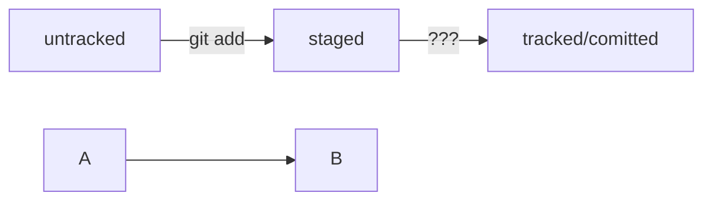

# ГИТ Мануал

## Инициализация проекта
----

1. Создать папку проекта командой mkdir
2. Ицициировать проект командой git init
3. Переименовать основную ветку при необходимости git branch -m <имя проекта> (по умолчанию имя **main**)

## Добавление файлов в проект
----

1. Создать файл через GUI или командой touch <имя файла>.
2. Внести изменения и сохранить
3. Добавить файл в репозиторий командой git add. 

## Коммит файла
----

1. Проверить статус репозитория командой git status
2. После добавления всех изменений ввести команду git commit -m <текст сообщения> 

## Синхронизация с github
----

1. Зайти на github под собственным логином. 
2. Создать репозиторий с тем же именем что и локальная папка с типом Privat
3. На локальном рабочем компьютере зайти в папку проекта и выполнить команду git remote add origin git@github.com:AndreyBogdanovich/<имя проекта>.git
4. Если проект синхронизируется впервые, выполнить команду загрузки проекта git push -u origin main

В дальнейшем достаточно запуска команды git push

HEAD -- это голова.

Коммит -- это всему голова.

Статусы файлов:
<тут пустая строка!>

